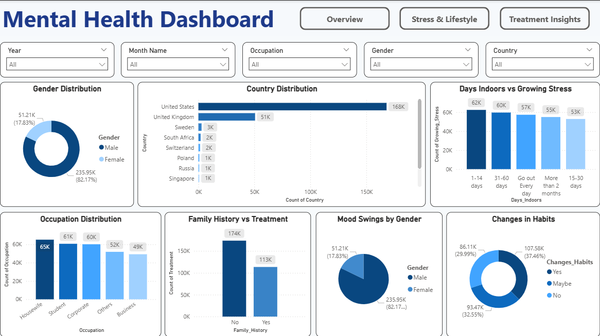
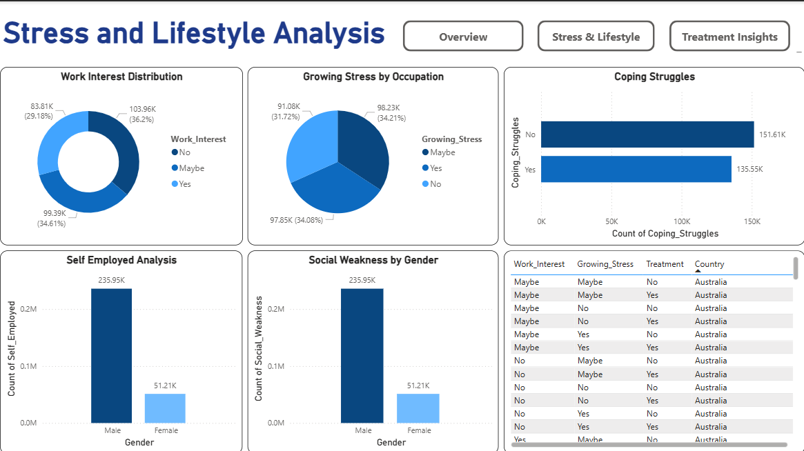
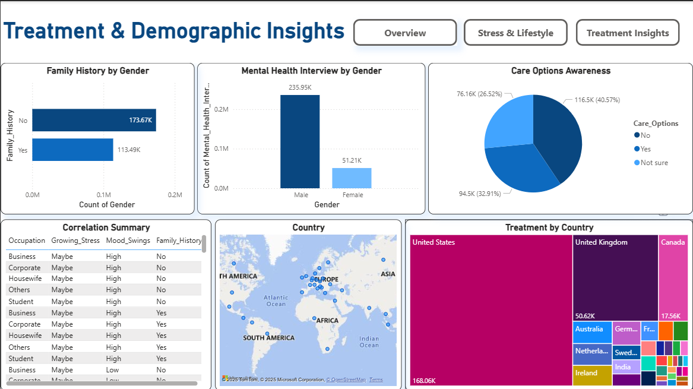

**🧠 Mental Health Insights Dashboard**
An interactive Power BI dashboard analyzing global mental health trends, lifestyle patterns, and treatment awareness.
This project aims to uncover how stress, occupation, and personal history influence mental well-being — helping researchers, policymakers, and healthcare professionals gain meaningful insights into mental health data.

🚀 Features
🔹 Key Metrics at a Glance

Total Responses: 287K+

Countries Covered: 10+

Gender Split: 82% Male, 18% Female

🔹 Overview Dashboard

Gender & Country Distribution – Understand participation demographics

Days Indoors vs Growing Stress – Correlation between isolation and stress

Occupation Distribution – Analyze stress trends across professions

Family History vs Treatment – Compare treatment rates based on family history

Mood Swings & Habit Changes – Identify emotional and behavioral shifts

🔹 Stress & Lifestyle Analysis

Work Interest Distribution – Measure job satisfaction and engagement

Growing Stress by Occupation – Highlight work-related stress levels

Coping Struggles – Understand how people deal with pressure

Social Weakness & Self-Employment by Gender – Identify gender-based lifestyle differences

🔹 Treatment & Demographic Insights

Family History by Gender – Examine hereditary mental health links

Mental Health Interview Willingness – Identify openness to seek help

Care Options Awareness – Track awareness of available treatment options

Treatment by Country (Tree Map) – Visualize treatment reach globally

Correlation Summary – Show relationships between stress, occupation, and mood swings

📈 Key Insights & Storytelling

Male respondents (82%) dominate, revealing gender bias in participation.

The United States and United Kingdom contribute the highest number of responses.

Housewives and students show higher stress levels compared to other professions.

Respondents with a family history of mental illness are more likely to seek treatment.

A significant portion of people remain unaware of available care options, emphasizing the need for awareness programs.

👉 Takeaway: The dashboard reveals a strong link between lifestyle, work environment, and mental health, with clear indicators of stress patterns and awareness gaps across demographics.

🛠 Tools & Technologies

Power BI → Interactive visualization and data modeling

Excel / CSV → Data preprocessing and cleaning

DAX & Power Query → Data transformation and measure creation

📂 Repository Structure
Mental_Health_Dashboard/
├── data/                            # Mental Mental Health Dataset.csv
├── Mental Health Dashboard.pbix     # Power BI dashboard file
├── Overview_Dashboard.png           # Overview page preview
├── Stress_Lifestyle_Analysis.png    # Stress & lifestyle page preview
├── Treatment_Insights.png           # Treatment & demographic page preview
├── README.md                        # Project documentation
└── LICENSE                          # MIT License

📸 Dashboard Preview

💼 Stress & Lifestyle

💊 Treatment Insights

📜 License

This project is licensed under the MIT License
.

## 📧 Contact
👤 **Vedika Sankhe**  
🔗 [GitHub](https://github.com/VedikaaSankhe) | [LinkedIn](https://www.linkedin.com/in/vedika-sankhe-707700317)  

⭐ If you found this project insightful, don’t forget to star the repo!
